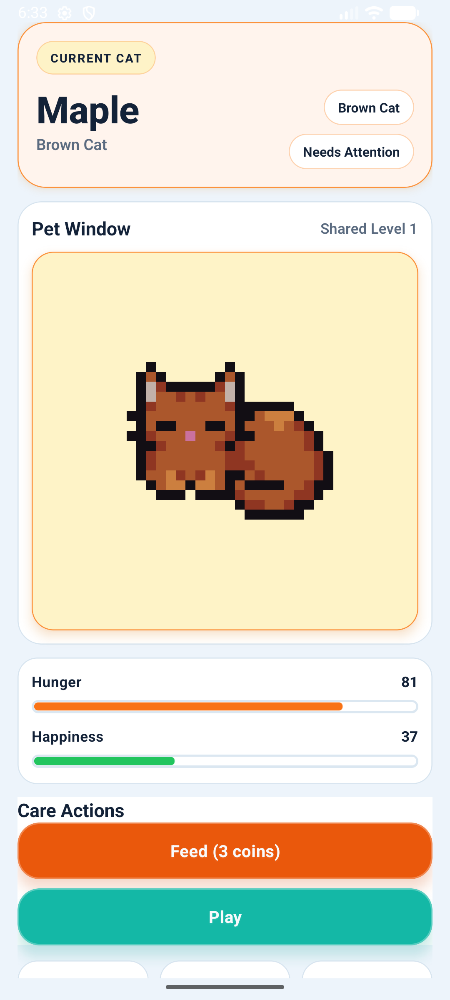
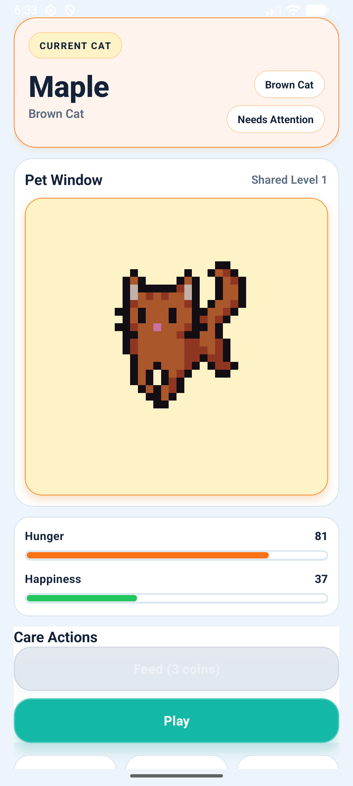
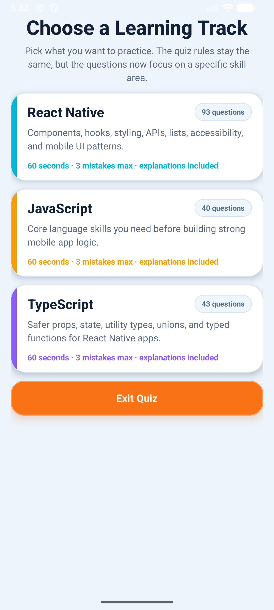
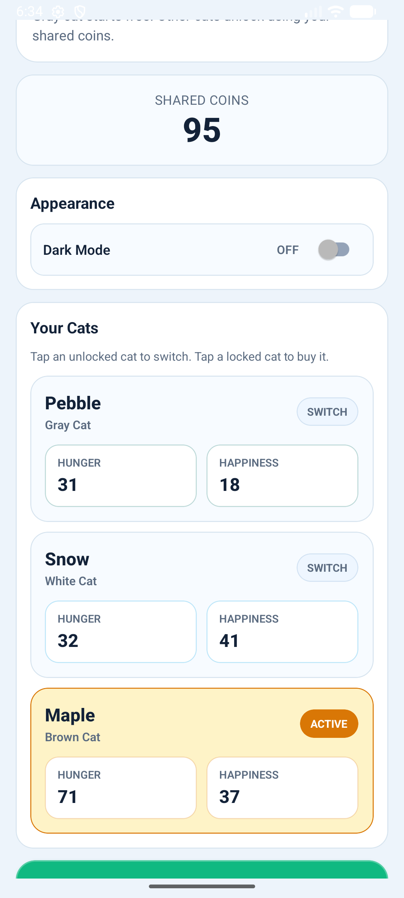
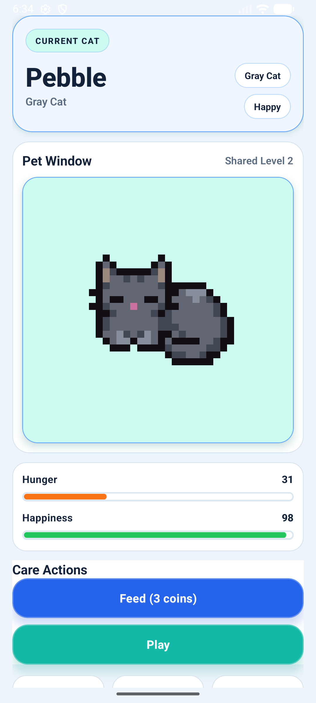
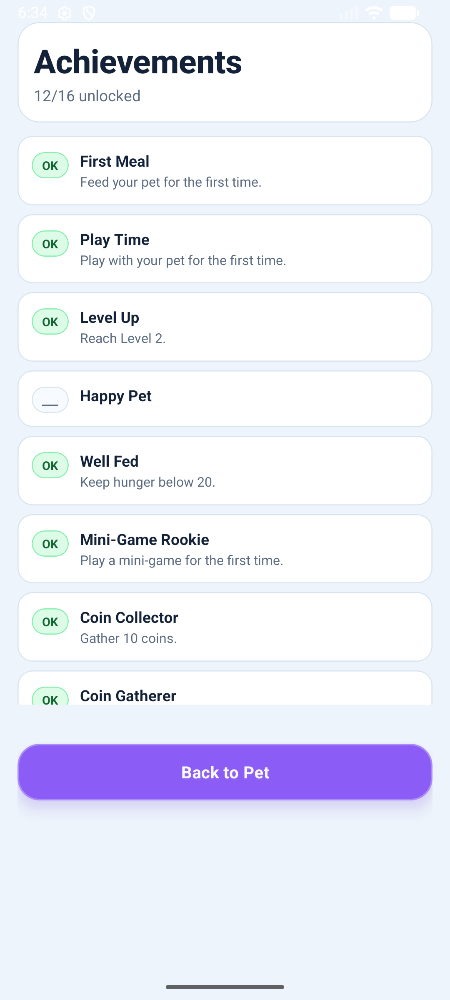

# Simple Digital Pet App

Bu proje, dijital bir evcil hayvan oyunu temeline, mini-quiz tabanlı öğrenme akışını ve oyunlaştırma sistemini ekleyerek geliştirilmiş bir React Native uygulamasıdır. Ana mantığı korunmuş, ancak çok ekranlı akış ve kalıcı ilerleme ile genişletilmiştir.

## Projenin amacı ve oyunlaştırma özellikleri

Oyunun amacı, kullanıcıyı hem evcil hayvan bakımıyla meşgul etmek hem de öğrenme odaklı mini oyunlarla geri bildirimli bir ilerleme sistemi sunmaktır.

- **Evcil Hayvan Bakımı**
  - Açlık (`hunger`) ve mutluluk (`happiness`) değerlerini yönetme
  - **Besle** ve **Oyna** aksiyonlarıyla anlık etki
  - Tüm değerler `0`–`100` aralığında sınırlıdır
- **Kedi Varyantları ve Kilit Sistemi**
  - Varsayılan olarak Gri kedi
  - Diğer kedi tipleri (ör. Beyaz, Kahverengi) coin ile açılır
  - Her kedi için ayrı ad, açlık ve mutluluk durumu
- **Mini Oyun (Learning Loop)**
  - React Native, JavaScript ve TypeScript track’leri
  - Zamanlı soru akışı ve hata sınırı
  - Her sorudan sonra doğru cevap açıklaması
  - Başarı puanı/coin kazanma döngüsü
- **Başarı Sistemi**
  - Başarılar tamamlanana kadar başlık olarak gizli görünür
  - Tamamlandığında detayları açılır
- **Uzun Vadeli Gelişim**
  - XP, coin, başarılar ve kedi durumları kalıcıdır
  - Zamanla pasif açlık artışı ve mutluluk düşüşü uygulanır
  - Karanlık/aydınlık tema desteği

## Özellikler

- Tek projede 4 ana ekran: Ana Pet, Mini-Game, Ayarlar, Başarılar
- Modern ve dinamik StyleSheet temelli arayüz
- Pet görselini destekleyen Sprite animasyon sistemi
- Tema, kart ve buton hiyerarşisiyle okunabilir UI
- Oyuncu verileri için kalıcı saklama (AsyncStorage)

## Kullanılan Teknolojiler

- React Native
- TypeScript
- AsyncStorage
- StyleSheet / Flexbox
- Tek dosya tabanlı mini oyun verisi
- Keşfedilebilir, modüler React component yapısı

## Ekran Görüntüleri

<p align="center">
  
  
  
</p>
<p align="center">
  
  
  
</p>

## Bileşen Yapısı

- `App.tsx`
  - Uygulama akışı ve global state
  - Ekran yönlendirme, kalıcı veri yönetimi, ödül mantığı
- `PixelCat.tsx`
  - Kedi görseli ve animasyon kontrolü
- `PetCard.tsx`
  - Ana pet bilgileri, stat çubukları ve etkileşim alanı
- `MiniGameScreen.tsx`
  - Track bazlı mini-quiz akışı ve soru mantığı
- `SettingsScreen.tsx`
  - Kedi ismi değiştirme, kedi seçimi, coin ile açma
- `AchievementsScreen.tsx`
  - Başarı takibi, kilitli/açık gösterim
- `src/utils/*`
  - Mini oyun soru havuzu, skor/puan yardımcı fonksiyonları
- `src/types/*`
  - Tip güvenliği ve model tanımları

## State Mantığı (Kısa)

- `hunger` ve `happiness` her işlemden sonra güvenli şekilde sınırlandırılır (`clamp`)
- Besleme açıkça açlık düşürür
- Oyun ve mini oyun etkileşimleri mutluluğu etkiler
- Mini oyun kayıpları, zaman limiti ve coin kazanımı ayrı kurallarla yönetilir
- Her kedi türü için ayrı durum saklanırken, coin/XP/başarılar oyuncuya özeldir ama paylaşılan sistemle tutulur

## Adım adım "Nasıl Çalıştırılır?" (Installation & Run)

### 1) Bağımlılıkları kur

```bash
npm install
```

### 2) Metro’yu başlat

```bash
npm start
```

### 3) Android uygulamasını başlat

Emülatör veya fiziksel cihaz bağlı ve USB debug açık olmalı.

```bash
npm run android
```

### 4) Üretim APK üretimi (isteğe bağlı)

```bash
cd android
.\\gradlew.bat assembleRelease
```

## 1 dakikalık YouTube tanıtım videosunun linki

- [YouTube Tanıtım Videosu](https://youtube.com/shorts/J9XgYdvjVMY?feature=share)

## Yayın (Production) Notu

Projede release imzalama yapılandırması eklenmiştir (`android/key.properties` ve `android/app/build.gradle`). İmzalı bir `release` build için gerekli yapılandırmalar bu dosyalarda tutulur.

## Kurulum Notları

- `.gitignore` içinde keystore ve APK/AAB/`android/key.properties` gibi hassas dosyalar korunmaktadır.
- Kullanıcı verisi ve ayarlar cihazda saklanır, uygulama yeniden başlatıldığında geri yüklenir.

