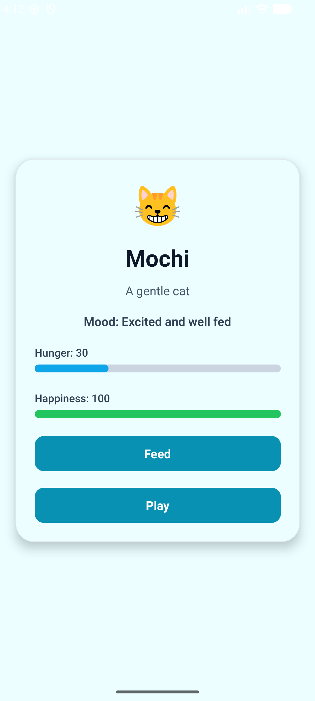
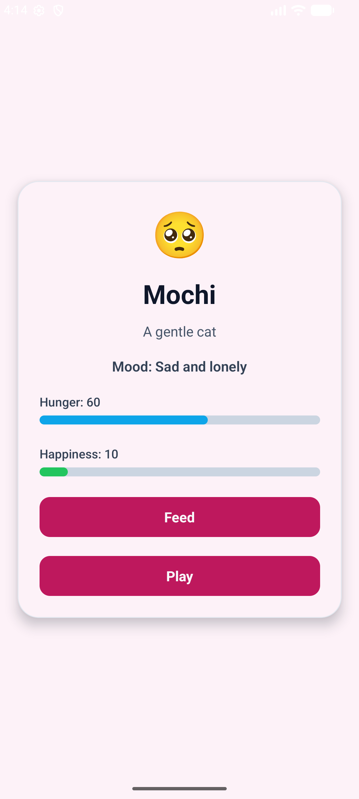
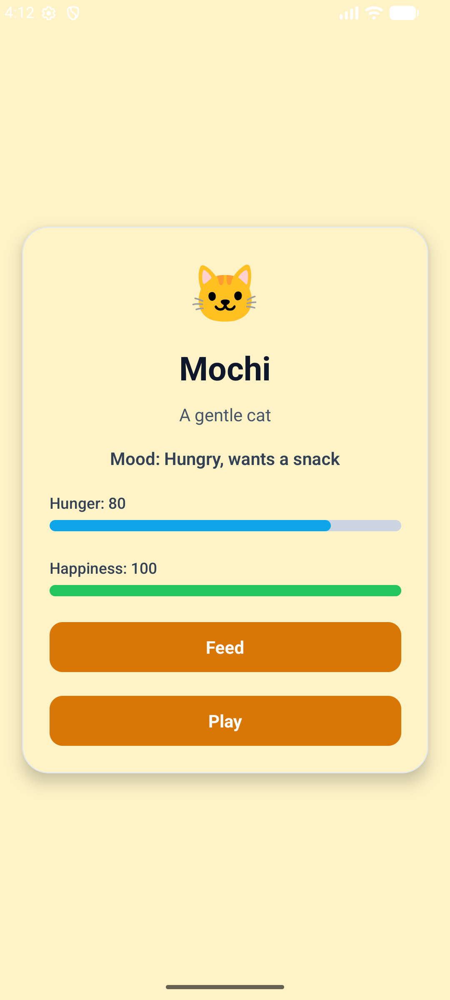

# Simple Digital Pet App

Bu proje, sınıf içi bir mobil uygulama challenge görevi için geliştirilmiş basit bir **React Native dijital evcil hayvan uygulamasıdır**.

Uygulamada bir evcil hayvanın **adı** ve **türü** gösterilir. Kullanıcı, **Besle** ve **Oyna** butonlarıyla evcil hayvanın **açlık** ve **mutluluk** değerlerini değiştirebilir.

## Özellikler

- Evcil hayvanın adını ve türünü gösterir
- Açlık ve mutluluk değerlerini gösterir
- **Besle** butonu ile açlığı azaltır
- **Oyna** butonu ile mutluluğu artırır
- Değerler `0` ile `100` arasında sınırlandırılmıştır
- Duruma göre değişen ruh hali metni bulunur
- Duruma göre değişen emoji kullanılır
- Duruma göre değişen kart rengi bulunur

## Kullanılan Teknolojiler

- React Native
- TypeScript
- StyleSheet
- Flexbox

## Projenin Amacı

Bu projenin amacı şunları pratik etmektir:

- tekrar kullanılabilir component oluşturma
- **props** ve **state** kullanımı
- buton etkileşimleri ile veri güncelleme
- state’e göre arayüzü dinamik olarak değiştirme
- elle yazılmış ilk sürümü AI desteğiyle iyileştirme ve refactor etme

## Bileşen Yapısı

### `App`
Uygulamanın ana ekranıdır.

Sorumlulukları:
- `hunger` state’ini tutmak
- `happiness` state’ini tutmak
- pet component’ine props göndermek
- **Besle** ve **Oyna** işlemlerini yönetmek

### `Pet`
Tekrar kullanılabilir evcil hayvan component’idir.

Gösterdiği bilgiler:
- evcil hayvan adı
- türü
- açlık değeri
- mutluluk değeri
- ruh hali
- emoji
- aksiyon butonları

## State Mantığı

- **Besle** işlemi açlığı azaltır
- **Oyna** işlemi mutluluğu artırır
- **Oyna** işlemi açlığı bir miktar artırabilir
- tüm değerler `0` ile `100` arasında tutulur

## Ekran Görüntüleri

<p align="center">
  
  
  
</p>

## Nasıl Çalıştırılır

```bash
npm install
npm start
npm run android
```

## Öğrenilenler

Bu projede şunları öğrendim:

- `useState` ile state yönetimi
- props ile veri aktarma
- basit ve etkileşimli bir component geliştirme
- `Math.min` ve `Math.max` ile state değerlerini sınırlandırma
- Flexbox ve StyleSheet ile daha düzenli bir arayüz oluşturma
- ilk yazılan kaba kodu daha temiz bir yapıya dönüştürme

## AI Prompt Özeti

**Kullanılan prompt:**

> I wrote this React Native digital pet app myself as a rough skeleton. Please improve this code as a senior developer, but keep the same basic logic and structure. Center the layout using Flexbox, add a modern StyleSheet design, add dynamic emoji and dynamic mood text based on hunger and happiness, optionally change card/background color depending on the pet state, keep hunger and happiness between 0 and 100, refactor with clean code principles, and briefly explain what you improved and why.

**AI desteğinden öğrendiğim kısa not:**

Açlık ve mutluluk gibi state değerlerinin `Math.max` ve `Math.min` ile sınırlandırılmasının, hatalı değer oluşmasını engellediğini öğrendim. Ayrıca emoji, ruh hali metni ve renk gibi arayüz detaylarının doğrudan state’e göre türetilebileceğini gördüm.
